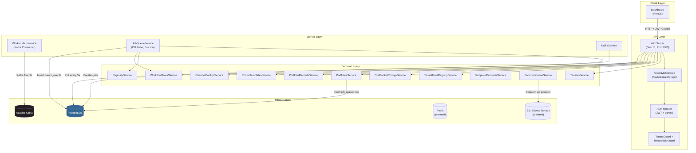
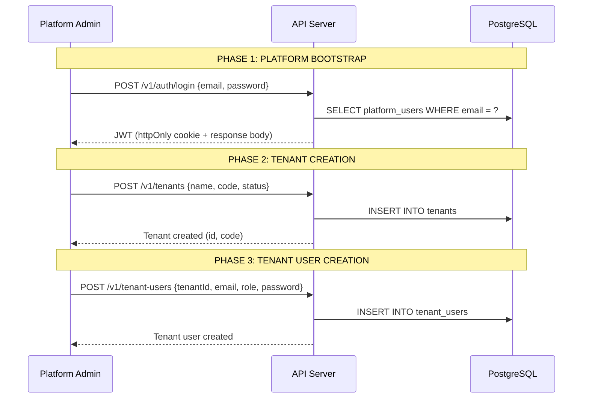
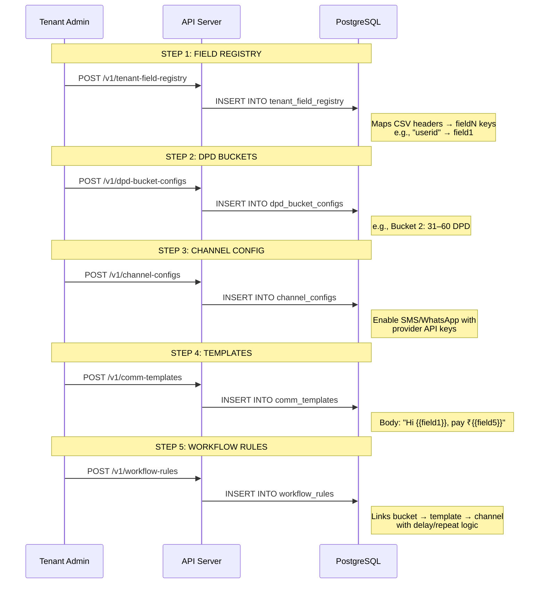
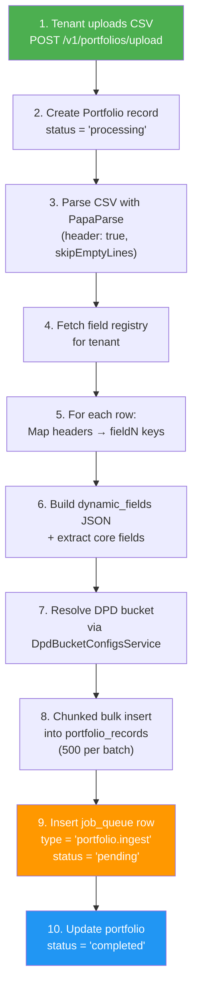
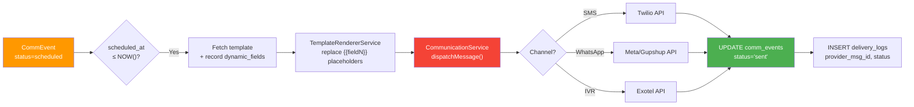
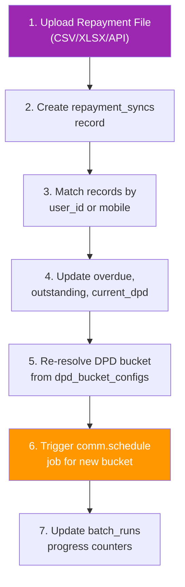
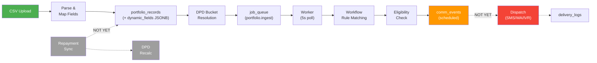
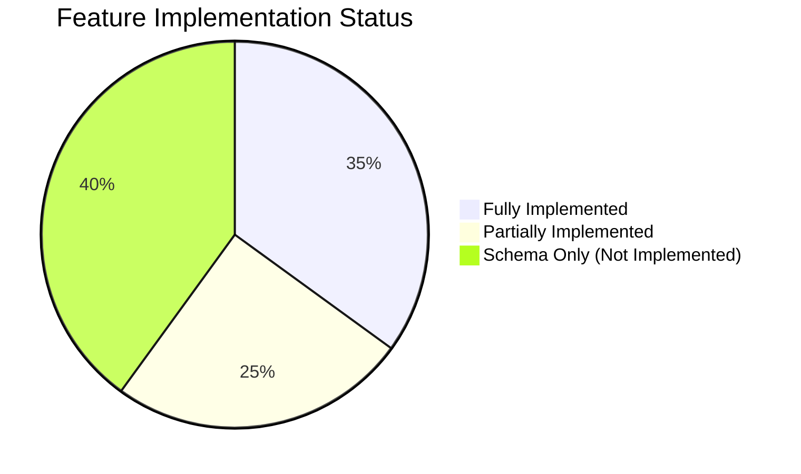

# Cleerio — Functional Requirements Document (FRD) & Business Requirements Document (BRD)

> **System**: Cleerio Collections Automation Platform  
> **Version**: 1.0 (Analysis Snapshot)  
> **Date**: April 3, 2026  
> **Status**: Active Development — Gap Analysis Included

---

## 1. Executive Summary

Cleerio is a **multi-tenant SaaS collections automation platform** designed for NBFCs (Non-Banking Financial Companies) and lending institutions. It automates the lifecycle of debt recovery communications — from portfolio data ingestion through DPD (Days Past Due) bucketing, workflow rule evaluation, eligibility filtering, template-based message composition, multi-channel dispatch (SMS, WhatsApp, IVR, Voice Bot), delivery tracking, and compliance reporting.

The system follows an event-driven, job-queue architecture with three deployable units:
- **API** (NestJS REST) — tenant-scoped CRUD + file upload
- **Worker** (NestJS Kafka Microservice + DB Poller) — background job processing
- **Dashboard** (Next.js) — operational UI for tenant and platform users

---

## 2. System Architecture Overview



---

## 3. Process Workflow — End-to-End (Step by Step)

### Phase 1: Platform Setup & Tenant Onboarding



| Step | Actor | Endpoint | Description | Status |
|------|-------|----------|-------------|--------|
| 1.1 | Platform Admin | `POST /v1/auth/login` | Authenticate via `platform_users` table with bcrypt | ✅ Implemented |
| 1.2 | Platform Admin | `POST /v1/tenants` | Create new tenant with unique `code` (slug) | ✅ Implemented |
| 1.3 | Platform Admin | — | Create tenant admin user in `tenant_users` | ⚠️ No dedicated API endpoint — seed script only |
| 1.4 | Platform Admin | — | Configure `tenant.settings` (whitelabel, timezone) | ⚠️ No update endpoint |

---

### Phase 2: Tenant Configuration



| Step | Actor | Endpoint | Description | Status |
|------|-------|----------|-------------|--------|
| 2.1 | Tenant Admin | `POST /v1/tenant-field-registry` | Register column→fieldN mappings from CSV headers | ✅ Implemented |
| 2.2 | Tenant Admin | `POST /v1/dpd-bucket-configs` | Define DPD ranges and risk buckets | ✅ Implemented |
| 2.3 | Tenant Admin | `POST /v1/channel-configs` | Enable channels (SMS, WhatsApp, IVR) with provider config | ✅ Implemented |
| 2.4 | Tenant Admin | `POST /v1/comm-templates` | Create message templates with `{{fieldN}}` placeholders | ✅ Implemented |
| 2.5 | Tenant Admin | `POST /v1/workflow-rules` | Link bucket → template → channel with scheduling rules | ✅ Implemented |

---

### Phase 3: Portfolio Data Ingestion (Core Data Pipeline)

This is the most critical flow in the system. Here's the detailed step-by-step:



#### Detailed Data Mapping Logic

```
CSV Row: { "userid": "USR20965326", "Name": "Karan Chavda", "current_dpd": "45", "over_due": "4200" }
                        ↓
Field Registry Lookup: { "userid" → field1, "Name" → field2, "current_dpd" → field5, "over_due" → field6 }
                        ↓
Portfolio Record:
{
  portfolioId: "...",
  tenantId: "...",
  userId: "USR20965326",       ← core field (if displayLabel === 'userId')
  name: "Karan Chavda",        ← core field
  currentDpd: 45,              ← core field (coerced to number)
  overdue: 4200,               ← core field (coerced to number)
  dpdBucket: "Bucket 2",       ← resolved from dpd_bucket_configs (31 ≤ 45 ≤ 60)
  dynamicFields: {
    "field1": "USR20965326",
    "field2": "Karan Chavda",
    "field5": "45",
    "field6": "4200"
  }
}
```

---

### Phase 4: Background Job Processing & Communication Event Generation

```mermaid
sequenceDiagram
    participant CRON as JobQueueService<br/>(5s Cron)
    participant DB as PostgreSQL
    participant WF as WorkflowRulesService
    participant ELIG as EligibilityService
    participant OPT as opt_out_list
    participant CHAN as channel_configs

    Note over CRON,DB: Worker polls every 5 seconds
    CRON->>DB: SELECT FROM job_queue<br/>WHERE status='pending'<br/>AND run_after <= NOW()<br/>FOR UPDATE SKIP LOCKED
    DB-->>CRON: Locked job rows (max 5)

    loop For each job
        CRON->>DB: UPDATE status = 'running'
        
        alt job_type = 'portfolio.ingest'
            CRON->>DB: SELECT * FROM portfolio_records<br/>WHERE portfolio_id = ?
            
            loop For each record with dpdBucket
                CRON->>WF: fetchActiveRulesForBucket(bucket)
                WF-->>CRON: Matching workflow rules

                loop For each rule
                    CRON->>ELIG: evaluateRecordEligibility(recordId, channel)
                    ELIG->>DB: Check record exists & not opted out
                    ELIG->>OPT: Check opt_out_list for mobile
                    ELIG->>CHAN: Check channel_configs.is_enabled
                    ELIG-->>CRON: { eligible: true/false, reason }

                    alt eligible = true
                        CRON->>DB: INSERT INTO comm_events<br/>{status='scheduled', scheduledAt, idempotencyKey}
                    end
                end
            end
        end

        CRON->>DB: UPDATE status = 'completed'
    end
```

| Step | Component | Description | Status |
|------|-----------|-------------|--------|
| 4.1 | `JobQueueService` | Poll `job_queue` every 5 seconds using `FOR UPDATE SKIP LOCKED` | ✅ Implemented |
| 4.2 | `JobQueueService` | Process up to 5 jobs per cycle | ✅ Implemented |
| 4.3 | `handlePortfolioIngest` | Fetch all records for portfolio | ✅ Implemented |
| 4.4 | `WorkflowRulesService` | Match active rules to record's DPD bucket | ⚠️ Partial (see gaps) |
| 4.5 | `EligibilityService` | Check opt-out, channel enabled | ✅ Implemented |
| 4.6 | — | Generate `comm_events` rows | ✅ Implemented |
| 4.7 | — | Template rendering at dispatch time | ⚠️ Partial (renderer exists, not wired to dispatch) |

---

### Phase 5: Communication Dispatch (Planned — Not Fully Implemented)



| Step | Component | Description | Status |
|------|-----------|-------------|--------|
| 5.1 | `comm.dispatch` job | Pick scheduled events due for dispatch | ❌ NOT Implemented |
| 5.2 | `TemplateRendererService` | Replace `{{fieldN}}` with record values | ✅ Implemented (not wired) |
| 5.3 | `CommunicationService` | Call provider API (SMS/WhatsApp/IVR) | ❌ Stub only (mock return true) |
| 5.4 | `delivery_logs` | Store provider response, delivery status | ❌ NOT Implemented |
| 5.5 | Webhook handler | Receive provider delivery callbacks | ❌ NOT Implemented |

---

### Phase 6: Repayment Sync & DPD Recalculation (Planned)



| Step | Description | Status |
|------|-------------|--------|
| 6.1 | Upload repayment data | ❌ No controller/service |
| 6.2 | Match and update portfolio records | ❌ Not implemented |
| 6.3 | DPD recalculation job (`dpd.recalc`) | ❌ Not implemented |
| 6.4 | Re-trigger workflow rules for new bucket | ❌ Not implemented |

---

### Phase 7: Reporting

| Step | Endpoint | Description | Status |
|------|----------|-------------|--------|
| 7.1 | `GET /v1/reports/portfolio-summary` | Aggregate totals (outstanding, overdue, record count) | ✅ Implemented |
| 7.2 | `GET /v1/reports/dpd-distribution` | Group-by bucket with overdue sums | ✅ Implemented |
| 7.3 | `report_jobs` table | Async report generation via job queue | ❌ Schema exists, no service |
| 7.4 | Delivery summary report | comm_events + delivery_logs aggregation | ❌ Not implemented |

---

## 4. Data Flow Summary



---

## 5. Schema vs Implementation — Gap Analysis

### 5.1 Tables with Full CRUD Implementation

| Table | Create | Read | Update | Delete | Notes |
|-------|--------|------|--------|--------|-------|
| `tenants` | ✅ | ✅ | ❌ | ❌ | No update/settings endpoint |
| `platform_users` | ✅ (seed) | ✅ (login) | ❌ | ❌ | Only via seed script |
| `tenant_users` | ✅ (seed) | ✅ (login) | ❌ | ❌ | No CRUD API, only auth |
| `tenant_field_registry` | ✅ | ✅ | ❌ | ❌ | Via BaseRepository |
| `portfolios` | ✅ | ✅ | ✅ (status) | ✅ | Full lifecycle |
| `portfolio_records` | ✅ (bulk) | ✅ | ❌ | ❌ | No individual update |
| `dpd_bucket_configs` | ✅ | ✅ | ❌ | ❌ | Resolve logic works |
| `channel_configs` | ✅ | ✅ | ❌ | ❌ | Via BaseRepository |
| `comm_templates` | ✅ | ✅ | ❌ | ❌ | Via BaseRepository |
| `workflow_rules` | ✅ | ✅ | ✅ | ✅ | Full CRUD |
| `job_queue` | ✅ (auto) | ✅ | ✅ (auto) | ❌ | Worker-managed |
| `comm_events` | ✅ (auto) | ❌ | ❌ | ❌ | No read API |

### 5.2 Tables with Schema Only (No Implementation)

| Table | Schema Defined | Service | Controller | Notes |
|-------|---------------|---------|------------|-------|
| `repayment_syncs` | ✅ | ❌ | ❌ | Entire repayment flow missing |
| `batch_runs` | ✅ | ❌ | ❌ | Progress tracking not wired |
| `batch_errors` | ✅ | ❌ | ❌ | Error capture not wired |
| `scheduled_jobs` | ✅ | ❌ | ❌ | Cron scheduler daemon missing |
| `delivery_logs` | ✅ | ❌ | ❌ | Provider callbacks missing |
| `opt_out_list` | ✅ | ❌ (read only) | ❌ | Only checked in eligibility |
| `report_jobs` | ✅ | ❌ | ❌ | Async report generation missing |
| `audit_logs` | ✅ | ❌ | ❌ | No audit trail implementation |

---

## 6. Critical Code Issues & Bugs Found

> [!CAUTION]
> ### BUG-01: WorkflowRulesService passes `dpdBucket` name instead of `bucket_id`
> 
> In [job-queue.service.ts](file:///d:/git%20repo/cleerio-monorepo/apps/worker/src/job-queue/job-queue.service.ts#L74), the call is:
> ```ts
> const rules = await this.workflowService.fetchActiveRulesForBucket(record.dpdBucket);
> ```
> But `record.dpdBucket` is a **bucket name** string (e.g., `"Bucket 2"`), while `fetchActiveRulesForBucket()` filters by `r.bucketId` which is a **UUID** foreign key to `dpd_bucket_configs.id`.
> 
> **Result**: This comparison will **never match** — no comm_events will ever be generated.
> 
> **Fix**: Resolve the `dpd_bucket_configs.id` from the bucket name first, or change the filter to join on `bucket_name`.

> [!WARNING]
> ### BUG-02: Kafka event creates job with wrong `job_type`
> 
> In [kafka.service.ts](file:///d:/git%20repo/cleerio-monorepo/apps/worker/src/kafka/kafka.service.ts#L16-L17):
> ```ts
> jobType: 'portfolio_ingest_recalc'  // ← Kafka creates this type
> ```
> But in [job-queue.service.ts](file:///d:/git%20repo/cleerio-monorepo/apps/worker/src/job-queue/job-queue.service.ts#L45):
> ```ts
> if (row.job_type === 'portfolio.ingest')  // ← Worker only handles this type
> ```
> **Result**: Jobs created via Kafka events will **never be processed** — they sit in `pending` forever.

> [!WARNING]
> ### BUG-03: Portfolio ingestion uses raw SQL that bypasses Drizzle schema
> 
> In [job-queue.service.ts](file:///d:/git%20repo/cleerio-monorepo/apps/worker/src/job-queue/job-queue.service.ts#L65-L68):
> ```ts
> const records = await db.select().from(sql.raw('portfolio_records')).where(...)
> ```
> Uses `sql.raw()` instead of the typed `portfolioRecords` schema, meaning the column names in the `.where()` clause use raw SQL but incorrectly reference JS property names (`dpdBucket`) instead of database column names (`dpd_bucket`).

> [!WARNING]
> ### BUG-04: `tenants.service.ts` has import after export
> 
> In [tenants.service.ts](file:///d:/git%20repo/cleerio-monorepo/libs/domain/src/modules/tenants/tenants.service.ts#L19):
> ```ts
> // Line 19 — import AFTER the class export
> import { eq } from 'drizzle-orm';
> ```
> This import needs to be moved to the top of the file.

> [!NOTE]
> ### ISSUE-05: Worker transaction scope too broad
> 
> In `job-queue.service.ts`, the entire polling + processing loop runs inside a single transaction. If `handlePortfolioIngest` takes minutes (for large portfolios), the transaction holds locks on all 5 claimed jobs, blocking other workers. The handler should run **outside** the claim transaction.

> [!NOTE]
> ### ISSUE-06: Idempotency key in comm_events is insufficient
> 
> Current format: `ingest_${record.id}_${rule.id}`
> 
> This doesn't include `channel` or `date`, meaning re-running the same ingest job won't be properly deduplicated. The schema expects `record_id:channel:YYYY-MM-DD` format.

> [!NOTE]
> ### ISSUE-07: Channel hardcoded to 'sms'
> 
> In `job-queue.service.ts:78,90`, the channel is hardcoded to `'sms'` instead of reading `rule.channel` from the workflow rule.

---

## 7. Security Model

### Authentication Flow
```
Login Request → AuthService.validateTenantUser/PlatformUser → bcrypt.compare
    → JwtService.sign({ sub, email, role, tenantId, isPlatformUser })
    → Set httpOnly cookie 'access_token' + return token in body
```

### Authorization Layers

| Layer | Mechanism | Implementation |
|-------|-----------|---------------|
| **L1: Authentication** | `JwtAuthGuard` (Passport) | ✅ Extracts JWT from cookie or Bearer header |
| **L2: Tenant Isolation** | `TenantMiddleware` (AsyncLocalStorage) | ✅ Sets tenant context from `x-tenant-id` header |
| **L3: Tenant Enforcement** | `TenantGuard` | ✅ Ensures tenant context exists (falls back to JWT `tenantId`) |
| **L4: Role-Based Access** | `TenantRoleGuard` + `@Roles()` decorator | ✅ Checks user role against required roles |
| **L5: Data Isolation** | `BaseRepository.withTenant()` | ✅ Auto-scopes all queries with `tenant_id` filter |

### Role Matrix

| Role | Scope | Can Upload Portfolio | Can Create Templates | Can View Reports | Can Manage Tenants |
|------|-------|---------------------|---------------------|-----------------|-------------------|
| `platform_admin` | Global | ✅ (override) | ✅ (override) | ✅ | ✅ |
| `platform_ops` | Global | ❌ | ❌ | ✅ | ✅ (read only) |
| `tenant_admin` | Tenant | ✅ | ✅ | ✅ | ❌ |
| `ops` | Tenant | ✅ | ❌ | ✅ | ❌ |
| `analyst` | Tenant | ❌ | ❌ | ✅ | ❌ |
| `viewer` | Tenant | ❌ | ❌ | ✅ (limited) | ❌ |

---

## 8. API Endpoint Catalog

### Implemented Endpoints

| Method | Path | Guard(s) | Role(s) | Description |
|--------|------|----------|---------|-------------|
| `POST` | `/v1/auth/login` | None | Any | Login (platform or tenant) |
| `GET` | `/v1/auth/profile` | JWT | Any | Get authenticated user profile |
| `POST` | `/v1/tenants` | JWT | `platform_admin` | Create tenant |
| `GET` | `/v1/tenants` | JWT | `platform_admin`, `platform_ops` | List all tenants |
| `GET` | `/v1/tenants/:code` | JWT | Any | Get tenant by code |
| `POST` | `/v1/tenant-field-registry` | JWT, Tenant | Tenant roles | Register field mapping |
| `GET` | `/v1/tenant-field-registry` | JWT, Tenant | Tenant roles | List field mappings |
| `POST` | `/v1/dpd-bucket-configs` | JWT, Tenant | Tenant roles | Create DPD bucket |
| `GET` | `/v1/dpd-bucket-configs` | JWT, Tenant | Tenant roles | List DPD buckets |
| `POST` | `/v1/channel-configs` | JWT, Tenant | Tenant roles | Configure channel |
| `GET` | `/v1/channel-configs` | JWT, Tenant | Tenant roles | List channels |
| `POST` | `/v1/comm-templates` | JWT, Tenant | Tenant roles | Create template |
| `GET` | `/v1/comm-templates` | JWT, Tenant | Tenant roles | List templates |
| `POST` | `/v1/workflow-rules` | JWT, Tenant | Tenant roles | Create workflow rule |
| `GET` | `/v1/workflow-rules` | JWT, Tenant | Tenant roles | List workflow rules |
| `PUT` | `/v1/workflow-rules/:id` | JWT, Tenant | Tenant roles | Update workflow rule |
| `DELETE` | `/v1/workflow-rules/:id` | JWT, Tenant | Tenant roles | Delete workflow rule |
| `POST` | `/v1/portfolios/upload` | JWT, Tenant, Role | `tenant_admin`, `ops` | Upload CSV portfolio |
| `GET` | `/v1/portfolios` | JWT, Tenant | Tenant roles | List portfolios |
| `GET` | `/v1/portfolios/:id` | JWT, Tenant | Tenant roles | Get portfolio details |
| `DELETE` | `/v1/portfolios/:id` | JWT, Tenant, Role | `tenant_admin` | Delete portfolio |
| `GET` | `/v1/reports/portfolio-summary` | JWT, Tenant | Tenant roles | Aggregate stats |
| `GET` | `/v1/reports/dpd-distribution` | JWT, Tenant | Tenant roles | DPD bucket breakdown |
| `GET` | `/v1/jobs` | JWT, Role | `platform_admin`, `platform_ops` | List all system jobs |
| `GET` | `/v1/jobs/tenant/:tenantId` | JWT, Role | `platform_admin`, `platform_ops` | List tenant jobs |

### Missing Endpoints (Schema-Implied)

| Method | Path | For Table | Priority |
|--------|------|-----------|----------|
| `POST` | `/v1/tenant-users` | `tenant_users` | 🔴 High |
| `GET/PUT` | `/v1/tenant-users` | `tenant_users` | 🔴 High |
| `POST` | `/v1/repayment-syncs/upload` | `repayment_syncs` | 🔴 High |
| `POST/DELETE` | `/v1/opt-out` | `opt_out_list` | 🟡 Medium |
| `GET` | `/v1/comm-events` | `comm_events` | 🟡 Medium |
| `GET` | `/v1/delivery-logs` | `delivery_logs` | 🟡 Medium |
| `GET` | `/v1/batch-runs` | `batch_runs` | 🟡 Medium |
| `GET` | `/v1/audit-logs` | `audit_logs` | 🟢 Low |
| `POST` | `/v1/report-jobs` | `report_jobs` | 🟡 Medium |
| `GET/PUT` | `/v1/scheduled-jobs` | `scheduled_jobs` | 🟡 Medium |

---

## 9. Implementation Maturity Assessment



| Category | Maturity | Details |
|----------|----------|---------|
| **Multi-tenancy** | 🟢 90% | AsyncLocalStorage + BaseRepository auto-scoping. Solid pattern. |
| **Authentication** | 🟢 85% | JWT + bcrypt + cookie auth. Missing: refresh tokens, password reset. |
| **Authorization** | 🟡 70% | Role guards work. Missing: PlatformRoleGuard, granular permissions. |
| **Portfolio Ingestion** | 🟡 75% | CSV parse + field mapping + DPD resolution works. Bug in core field extraction logic. |
| **Job Queue** | 🟡 60% | `FOR UPDATE SKIP LOCKED` pattern is correct. Missing: retry backoff, dead letter, claim expiry recovery. |
| **Workflow Engine** | 🔴 30% | Rules match by bucket but BUG-01 means it never works. No `delay_days` scheduling. |
| **Communication Dispatch** | 🔴 10% | Template renderer exists but dispatch is a mock stub. No real provider integration. |
| **Delivery Tracking** | 🔴 0% | Schema exists but no implementation whatsoever. |
| **Repayment Sync** | 🔴 0% | Schema exists but no implementation whatsoever. |
| **Batch Processing** | 🔴 5% | Schema exists. No implementation (batch_runs, batch_errors not used). |
| **Scheduled Jobs** | 🔴 0% | Schema exists. No cron daemon implementation. |
| **Opt-Out / DNC** | 🟡 40% | Checked during eligibility but no CRUD API for managing the list. |
| **Reports** | 🟡 50% | Two sync aggregation endpoints. No async report generation via `report_jobs`. |
| **Audit Logs** | 🔴 0% | Schema exists but nothing writes to it. |
| **Dashboard** | 🟡 50% | Next.js app exists with login and basic pages. |

---

## 10. Recommended Implementation Priority

> [!IMPORTANT]
> ### Critical Path to MVP

| Priority | Item | Effort | Impact |
|----------|------|--------|--------|
| **P0** | Fix BUG-01 (bucket name vs ID mismatch) | 1 hour | Unblocks entire workflow engine |
| **P0** | Fix BUG-02 (Kafka job_type mismatch) | 30 min | Unblocks Kafka-driven processing |
| **P0** | Fix BUG-03 (raw SQL in worker) | 30 min | Prevents runtime query errors |
| **P1** | Implement `comm.dispatch` job handler | 2 days | Enables actual message sending |
| **P1** | Implement `delivery_logs` webhook handler | 1 day | Tracks delivery status |
| **P1** | Add `tenant_users` CRUD API | 1 day | Enables user management from dashboard |
| **P1** | Wire `TemplateRendererService` into dispatch flow | 1 day | Enables dynamic message rendering |
| **P2** | Implement repayment sync upload + DPD recalc | 3 days | Keeps portfolio data fresh |
| **P2** | Implement `batch_runs` + `batch_errors` tracking | 2 days | Adds observability to bulk ops |
| **P2** | Add `opt_out_list` CRUD API | 1 day | DNC compliance |
| **P3** | Implement `scheduled_jobs` cron daemon | 2 days | Enables recurring workflows |
| **P3** | Implement async `report_jobs` | 2 days | Background report generation |
| **P3** | Implement `audit_logs` middleware | 1 day | Compliance trail |
| **P3** | Add daily/hourly cap enforcement via Redis | 1 day | Rate limiting for channels |

---

## 11. Technology Stack Summary

| Component | Technology | Notes |
|-----------|-----------|-------|
| API Server | NestJS (Node.js) | REST API with Passport JWT auth |
| Worker | NestJS Microservice | Kafka consumer + DB job poller |
| Dashboard | Next.js | React-based tenant UI |
| Database | PostgreSQL | Drizzle ORM for type-safe queries |
| ORM | Drizzle | Schema-first, typed queries |
| Message Broker | Apache Kafka | Event-driven job creation |
| Cache | Redis (planned) | Rate limiting, session store |
| Object Storage | S3 (planned) | File uploads, report artifacts |
| Monorepo | Turborepo + pnpm | Workspace-based dependency management |
| Containerization | Docker + Docker Compose | Multi-service orchestration |

---

## 12. Glossary

| Term | Definition |
|------|-----------|
| **DPD** | Days Past Due — number of days a payment is overdue |
| **DPD Bucket** | A named range (e.g., Bucket 2 = 31-60 DPD) used to categorize risk |
| **DNC** | Do Not Call/Contact — opt-out compliance list |
| **NBFC** | Non-Banking Financial Company — the end-customer of Cleerio |
| **Field Registry** | Mapping system that translates CSV column headers to stable `fieldN` keys |
| **Dynamic Fields** | JSONB column storing all CSV values as `{field1: val, field2: val, ...}` |
| **Core Fields** | Typed database columns (`userId`, `mobile`, `currentDpd`, etc.) extracted from dynamic fields |
| **Workflow Rule** | A configured automation linking a DPD bucket to a template + channel + schedule |
| **CommEvent** | A scheduled communication record: one message to one borrower on one channel |
| **Idempotency Key** | Unique key preventing duplicate message sends (format: `recordId:channel:date`) |

---

*Document generated from codebase analysis of `cleerio-monorepo` at commit HEAD on April 3, 2026.*
