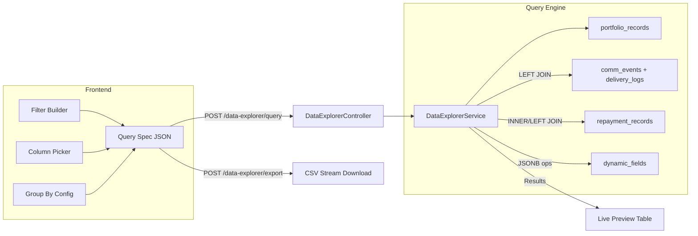

# Data Explorer — PowerBI-Style Reporting Module

Build an interactive, filterable data exploration page that lets tenant users query portfolio records across **all dimensions** (core fields, dynamic fields, communication delivery status, repayment data), pick visible columns, group/aggregate results, and export to CSV/Excel.

## User Review Required

> [!IMPORTANT]
> **Immediate Use Case**: "Get all records where SMS failed AND they had a repayment entry, grouped by state (dynamic field)."
> This drives the design — the query engine must support JOINs across `portfolio_records`, `comm_events`/`delivery_logs`, and `repayment_records`, with grouping on any field including JSONB dynamic fields.

> [!IMPORTANT]
> **Scope Decision**: This plan builds the explorer as a **new standalone page** (`/data-explorer`) rather than replacing the existing `/reports` page. The existing Reports page continues to serve its async job-based purpose. The Data Explorer is live, interactive, and synchronous.

## Open Questions

1. **Row limit for live preview** — The plan caps live preview at 1,000 rows for performance. Full exports (CSV) will stream all matching rows. Is 1,000 acceptable for live preview, or do you need more?
2. **Saved Queries** — Should we add a "Save this query" feature so users can bookmark frequent reports? (Not in v1 scope, but the schema would be trivial to add later.)

---

## Proposed Changes

### Backend: Query Engine Service

A single powerful endpoint that accepts a JSON query specification and returns filtered, optionally grouped results.

#### [NEW] `libs/domain/src/modules/data-explorer/data-explorer.controller.ts`

Two endpoints:

- `POST /data-explorer/query` — Accepts the query spec, returns paginated results (live preview, max 1000 rows)
- `POST /data-explorer/export` — Same query spec, streams full CSV/Excel to the client

```typescript
// Query spec shape:
interface DataExplorerQuery {
  filters: FilterRule[];        // Multi-dimensional filter rules
  columns: string[];            // Which columns to include in output
  groupBy?: string;             // Optional: group results by this field
  aggregations?: Aggregation[]; // When grouping: sum, count, avg on numeric fields
  sortBy?: string;              // Field to sort by
  sortDir?: 'asc' | 'desc';
  limit?: number;               // Max 1000 for live, unlimited for export
  offset?: number;
}

interface FilterRule {
  field: string;                // e.g. 'currentDpd', 'dynamicFields.state', 'commStatus', 'hasRepayment'
  operator: 'eq' | 'neq' | 'gt' | 'gte' | 'lt' | 'lte' | 'in' | 'contains' | 'is_null' | 'is_not_null';
  value: any;
  source: 'core' | 'dynamic' | 'comm' | 'repayment'; // Which table/join this filter targets
}

interface Aggregation {
  field: string;
  fn: 'count' | 'sum' | 'avg' | 'min' | 'max';
  alias: string;
}
```

---

#### [NEW] `libs/domain/src/modules/data-explorer/data-explorer.service.ts`

The query engine. Builds dynamic SQL using Drizzle ORM:

1. **Base query**: Always starts from `portfolio_records` scoped to tenant
2. **Comm filters**: When any filter has `source: 'comm'`, LEFT JOINs `comm_events` + `delivery_logs` and adds WHERE clauses on delivery status
3. **Repayment filters**: When any filter has `source: 'repayment'`, LEFT JOINs `repayment_records` and adds EXISTS/WHERE clauses
4. **Dynamic field filters**: Uses Postgres JSONB operators (`->>`, `@>`) on `portfolio_records.dynamic_fields`
5. **Column selection**: Only SELECTs the requested columns (prevents over-fetching)
6. **Grouping**: When `groupBy` is set, wraps the query with `GROUP BY` and applies aggregation functions
7. **Export**: Streams rows as CSV using `papaparse` (already a dependency)

Key implementation detail for the user's immediate query:
```sql
-- "SMS failed + has repayment, grouped by state"
SELECT 
  portfolio_records.dynamic_fields->>'state' AS state,
  COUNT(*) AS record_count,
  SUM(repayment_records.amount) AS total_repaid
FROM portfolio_records
LEFT JOIN comm_events ON comm_events.record_id = portfolio_records.id
LEFT JOIN delivery_logs ON delivery_logs.event_id = comm_events.id
INNER JOIN repayment_records ON repayment_records.portfolio_record_id = portfolio_records.id
WHERE portfolio_records.tenant_id = $1
  AND comm_events.channel = 'sms'
  AND delivery_logs.delivery_status = 'failed'
GROUP BY portfolio_records.dynamic_fields->>'state'
```

---

#### [NEW] `libs/domain/src/modules/data-explorer/data-explorer.module.ts`

Standard NestJS module wiring.

---

### Frontend: Data Explorer Page

#### [NEW] `apps/dashboard/app/data-explorer/page.tsx`

A full-page interactive query builder with these sections:

**1. Filter Builder Panel** (left/top)
- Dropdown to select filter dimension: Core Fields | Dynamic Fields | Communication | Repayment
- For each dimension, shows relevant field options
- Operator picker (equals, greater than, contains, etc.)
- Value input (text, number, or multi-select for enum-like fields)
- Filters render as removable chips
- Pre-built "Quick Filters" buttons for common queries (e.g. "SMS Failed", "Has Repayment", "DPD > 30")

**2. Column Picker** (collapsible panel)
- Checkbox list of all available columns (core + dynamic)
- "Select All" / "Deselect All" toggles
- Drag-reorder support (stretch goal, not v1)

**3. Group By + Aggregations** (optional section)
- Dropdown to pick a groupBy field
- When active, shows aggregation config: which numeric fields to SUM/AVG/COUNT

**4. Results Table**
- Uses the existing `DataTable` component with dynamic columns
- Shows live preview (up to 1000 rows)
- Pagination
- Row count badge

**5. Export Bar** (sticky bottom)
- "Export CSV" button — triggers `/data-explorer/export` and downloads the file
- Shows total matching row count

---

#### [MODIFY] `apps/dashboard/components/ui/sidebar.tsx`

Add "Data Explorer" nav item under the "Analytics" group:
```diff
 {
   label: 'Analytics',
   items: [
+    { name: 'Data Explorer', href: '/data-explorer', icon: TableProperties },
     { name: 'Reports', href: '/reports', icon: BarChart3 },
     { name: 'Repayments', href: '/repayments', icon: CreditCard },
     { name: 'AI Insights', href: '/ai-insights', icon: Sparkles },
   ],
 },
```

---

## Architecture Diagram



---

## Verification Plan

### Automated Tests
- `curl` the `/data-explorer/query` endpoint with the user's exact use case (SMS failed + repayment exists, group by state) and verify the SQL executes correctly
- Test edge cases: no filters, all filters, group by core field, group by dynamic field
- Verify CSV export downloads correctly with proper headers

### Manual Verification
- Build the query in the UI for: "Channel = SMS, Delivery Status = failed, Has Repayment = true, Group By = state"
- Confirm the grouped table shows state-wise counts and totals
- Click "Export CSV" and open in Excel to validate

---

## File Summary

| File | Action | Purpose |
|------|--------|---------|
| `libs/domain/src/modules/data-explorer/data-explorer.controller.ts` | NEW | Query + Export endpoints |
| `libs/domain/src/modules/data-explorer/data-explorer.service.ts` | NEW | Dynamic SQL query builder |
| `libs/domain/src/modules/data-explorer/data-explorer.module.ts` | NEW | NestJS module |
| `apps/dashboard/app/data-explorer/page.tsx` | NEW | Full interactive explorer UI |
| `apps/dashboard/components/ui/sidebar.tsx` | MODIFY | Add nav link |
