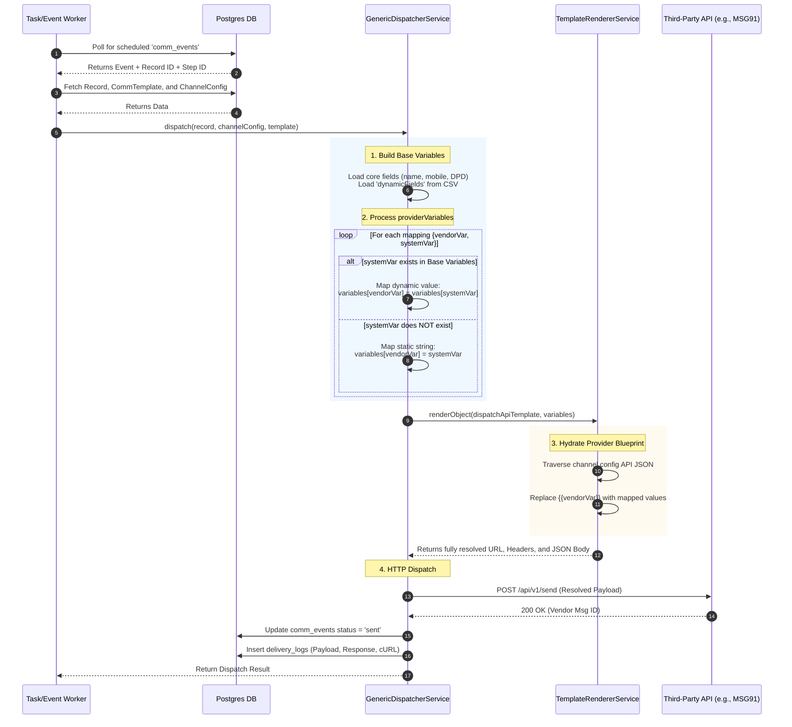

# Communication Dispatch Flow & Variable Mapping

Here is an end-to-end breakdown of how Cleerio handles template configurations, variable mapping, and the final dispatch of communications via the Generic Dispatcher.

## 1. Context Assembly (The Preparation Phase)
When a communication event is picked up by the worker, it gathers three critical pieces of context:
* **The Record:** The borrower's profile, including core fields (`name`, `mobile`, `currentDpd`) and `dynamicFields` (custom CSV columns).
* **The Template:** The `comm_templates` row, which contains the generic `body`, the `providerTemplateId`, and the crucial `providerVariables` mapping (e.g., `vendorVar: "VAR1", systemVar: "name"`).
* **The Channel Config:** The `channel_configs` row for the specific channel (e.g., SMS/WhatsApp). This contains the `dispatchApiTemplate`, which is the raw JSON blueprint (URL, method, headers, body structure) required by the third-party provider (like MSG91 or Gupshup).

## 2. Variable Resolution (The Mapping Phase)
The `GenericDispatcherService` builds a massive dictionary of variables to inject into the provider's API payload.
1. **Base Variables:** It adds all hardcoded system fields (like `record.name`, `record.mobile`) and all custom `dynamicFields` into a `variables` dictionary.
2. **Provider Mapping:** It iterates over the `providerVariables` defined in your Template UI.
   * *Dynamic Mapping:* If the `systemVar` exists in the `variables` dictionary (e.g., `systemVar` is `"name"`), it extracts the value and assigns it to the vendor variable key (e.g., `variables["VAR1"] = "John Doe"`).
   * *Static Mapping:* If the `systemVar` is **not** found in the dictionary (e.g., it is a hardcoded URL like `"https://pay.example.com"`), it treats the input as a literal string. It assigns `variables["VAR3"] = "https://pay.example.com"`.

## 3. Template Rendering (The Injection Phase)
The `TemplateRendererService` takes the raw `dispatchApiTemplate` from the Channel Configuration.
* It walks through the API blueprint (URL, Headers, and JSON Body).
* Wherever it sees double curly braces like `{{VAR1}}` or `{{VAR3}}`, it looks up that key in the newly populated `variables` dictionary and swaps it in.

## 4. Dispatch & Logging (The Execution Phase)
* The fully hydrated API object is sent out via a standard HTTP request using `axios`.
* The system simultaneously generates a raw `curl` command of the exact request for developer debugging.
* Finally, it updates the `comm_events` status to `sent` and saves the raw payload, URL, and vendor response in the `delivery_logs` table.

---

## Architectural Diagram

